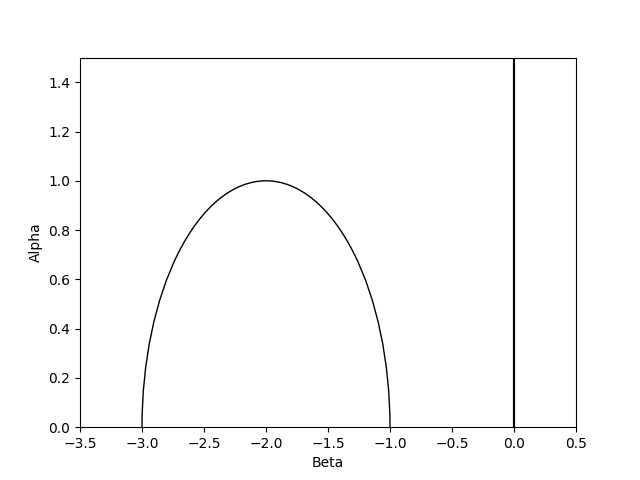
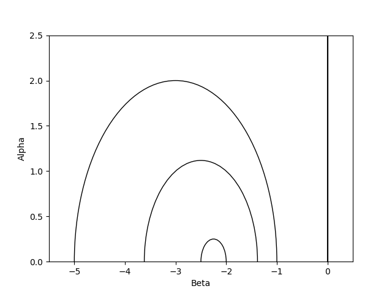

# Wall-and-Chamber decomposition on moduli spaces of K3 surfaces

### Brief Overview 
This project contains code to compute the Walls for Hilbert schemes and other moduli spaces on K3 surfaces, i.e. it implements the wall-and-chamber decomposition from

A. Bayer, E. Macrí: *"MMP for moduli of sheaves on K3s via wall-crossing"*
in *Inventiones mathematicae* 198 (3), 505-590. ([arXiv](https://arxiv.org/abs/1301.6968), [Inventiones](https://doi.org/10.1007/s00222-014-0501-8))


It includes furthermore the interactive program **main.py** to compute and show the walls for Hilbert schemes on K3 surfaces. Many of those are precomputed in small degrees.

> [!NOTE]
> The goal of the program is to give researchers a quick way to compute the nef and movable cones 
> as well as the wall-and-chamber decomposition of moduli spaces over very general K3 surfaces.
> 
> The hope is that this may lead to new insights on moduli spaces and to find relations with other objects. 

### Short example of main.py
Run the program *main.py*. The program asks you what you want to show and compute:
```
Type show|compute|showcompute|plot|rational|showwalls|depth|help|quit (s|c|sc|p|r|sw|d|h|q)
```
After typing for example *show* (if already computed) or *showcompute* we need to specify the K3 surface and the number of points
```
Degrees of K3s: 
2
Numbers of points: 
3
```
Then, the output are the movable divisors and the walls:
```
Hilb^[3] of H^2 = 2

-1/2 B+H         Brill-Noether
0 B+H    Hilbert-Chow

Brill-Noether
Vector inducing Wall: (-1, 1, -2)
Movable Divisor:      (1, -2, 2)
Contracted Divisor:   (1, -1, 2)

Hilbert-Chow
Vector inducing Wall: (0, 0, -1)
Movable Divisor:      (0, -1, 0)
Contracted Divisor:   (-1, 0, -2)
```
Using the *plot* function, we would get the follwing picture with *matplotlib* for Hilb^[3] and Hilb^[5] of the K3 surface with degree 2:




> [!NOTE]
> If the computations are too slow, change the depth to 2,1,1 or 1,1,1; see the documentation below. 
> However, be aware of possible down-sides, i.e. missing walls.

### Short example using the package
We give a short example of computing the walls for the Hilbert schemes of 3 points on a degree 2 K3 surface.
```
from modulispace import ModuliSpace
from modulispace import mVec
from modulispace import K3Surface

# Degree 2 K3 surface
k3 = K3Surface(2)

# Hilbert scheme of 3 points = M(1,0,-2)   
hilbert = ModuliSpace(k3, mVec(k3, 1,0,-2))   

# Specify ample vector 100H^[3] - B
ample = mVec(k3, 1, -100, 2)

# Compute walls
walls = hilbert.compute_walls(ample)

print(walls)
```
This has output:
```
Brill-Noether
Vector inducing Wall: (-1, 1, -2)
Movable Divisor:      (1, -2, 2)
Contracted Divisor:   (1, -1, 2)

Hilbert-Chow
Vector inducing Wall: (0, 0, -1)
Movable Divisor:      (0, -1, 0)
Contracted Divisor:   (-1, 0, -2)
```
To print the walls in a specific basis, one can also do the following:
```
# The divisor B = E/2, where E is the divisor of non-red. schemes
basis_1 = mVec(k3, -1, 0, -2)

# The divisor H^[3]
basis_2 = mVec(k3, 0, -1, 0)

# Compute the walls and show the movable divisors in he specified basis
walls = hilbert.compute_walls_printing(ample, basis_1, basis_2, name_1="B", name_2="H")
```
This outputs:
```
-1/2 B+H   Brill-Noether
0 B+H    Hilbert-Chow
```

### Small Documentation
#### Interface of main.py
> [!NOTE]
> The program does not yet compute fake walls. Instead, only walls corresponding to the birational contractions.
> Furthermore, the contracted divisor that the program shows is the primitive multiple of the actual divisor. 

> [!CAUTION]
> The program solves the generalized Pell-equations turning up in Bayer-Macrí's paper explicitly using SymPy. 
> However, for each parametric fundamental solution of these equations, the program only searches 2*depth-1 many of these solutions. 
> To increase the depth, see the documentation below.


Computed walls are stored in `.\Files\`.
We will explain the behaviour of the commands in the following line:
```
Type show|compute|showcompute|plot|rational|showwalls|depth|help|quit (s|c|sc|p|r|sw|d|h|q)
```
- show: Displays the movable cone decomposition and walls for the specified Hilbert scheme **if** it was already computed.
- compute: Computes the walls for the specified Hilbert scheme,
  **overwrites** the corresponding file in `.\Files\` and shows the decomosition of the movable cone.
- showcompute: Displays the movable cone decomposition and walls for the specified Hilbert scheme. Computes it if it was not computed before.
- plot: Plots the walls in the alpha-beta-plane.
- rational: Toggles between rational and decimal point outputs.
- showwalls: Toggle between showing walls and only showing decomosition of the movable cone
- depth: For each parametric solution of the generalized Pell equations the program takes 2*depth-1 many (small) solutions. 
- help: Shows help
- quit: Quit program


### Dependencies
This code uses Python with the standard libraries as well as SymPy, tqdm and matplotlib.

#### Author
Jonas Baltes


